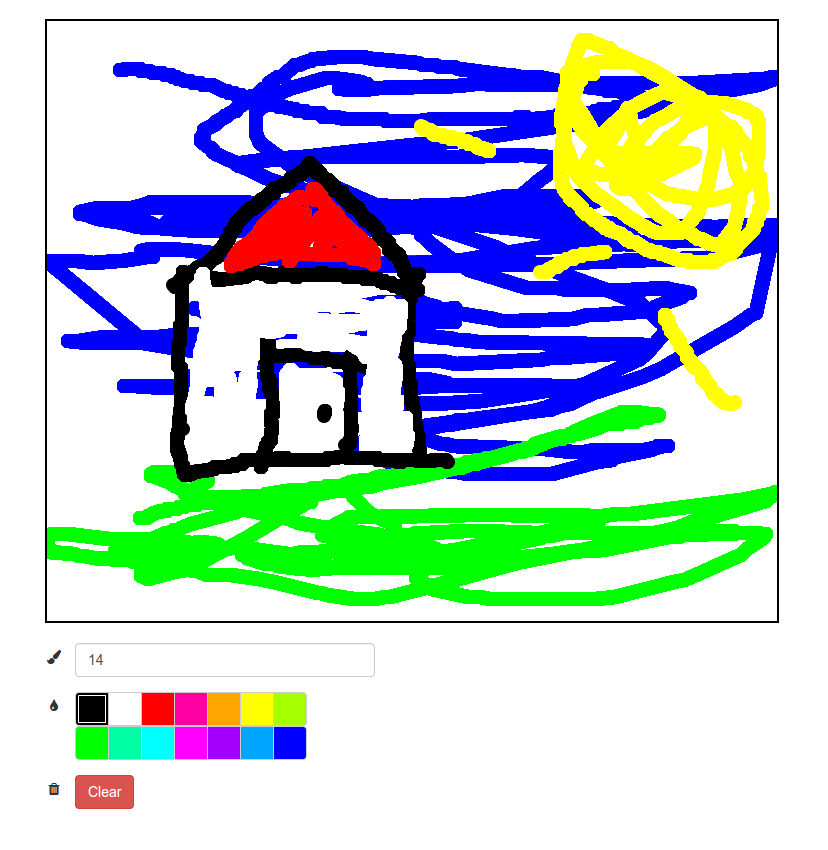

# Paint

This is a small web application made for drawing pictures. Or it would be, if only it were finished! Follow the instructions below to make it work.

## Instructions

First of all, we need to decide on how the program should function. The idea is that the user picks a brush size and a color, and then starts to draw using the mouse. As long as the mouse button is held down, we will keep drawing.

If the user changes the brush size or picks a new color, we need to update our own internal representation of this, so that the line actually gets drawn with the correct size and color.

There is also a button to clear the entire canvas, in case the user wants a fresh start.

To help with the drawing itself we will use two [APIs](http://en.wikipedia.org/wiki/Application_programming_interface), more specifically those of [rendering contexts](https://developer.mozilla.org/en/docs/Web/API/CanvasRenderingContext2D) and [user interface events](https://developer.mozilla.org/en-US/docs/Web/API/UIEvent). These APIs provides us with some functions for manipulating a *canvas*, i.e. the area that we will draw upon, and for working with user actions. More specifically, you will need to use the following methods and properties:

#### CanvasRenderingContext2D

* [`clearRect`](https://developer.mozilla.org/en-US/docs/Web/API/CanvasRenderingContext2D.clearRect)
* [`lineWidth`](https://developer.mozilla.org/en-US/docs/Web/API/CanvasRenderingContext2D.lineWidth)
* [`strokeStyle`](https://developer.mozilla.org/en-US/docs/Web/API/CanvasRenderingContext2D.strokeStyle)
* [`beginPath`](https://developer.mozilla.org/en-US/docs/Web/API/CanvasRenderingContext2D.beginPath)
* [`moveTo`](https://developer.mozilla.org/en-US/docs/Web/API/CanvasRenderingContext2D.moveTo)
* [`lineTo`](https://developer.mozilla.org/en-US/docs/Web/API/CanvasRenderingContext2D.lineTo)
* [`stroke`](https://developer.mozilla.org/en-US/docs/Web/API/CanvasRenderingContext2D.stroke)

#### UIEvent

* [`layerX`](https://developer.mozilla.org/en-US/docs/Web/API/UIEvent.layerX)
* [`layerY`](https://developer.mozilla.org/en-US/docs/Web/API/UIEvent.layerY)

The code has already been setup with a couple of callback functions that are triggered by different *events*. These events are created when the user performs a specific action, e.g. when clicking a button. Your task is to fill in the missing parts of these functions. The places where you are supposed to put your code are marked with comments.

### Step-by-step instructions

1. First, we need to be able to draw lines. Since this will be done with the mouse, let's take a look at the `onMouseDown` and `onMouseMove` functions.

  When the mouse button is pressed down we will need to move our imaginary brush to the position of the mouse at that time. This position can be found in the `event` parameter.

  Then, when the mouse is moved, we need to draw a line from the last position of our imaginary brush, to the current one.

2. Now we want to be able to change the color of the lines that are drawn. This is done by setting our internal representation of the brush color to the correct value in the `updateColor` function.

3. Changing the size of the brush is done in a similar fashion in the `updateSize` function. The current size can be found in `size.value`.

4. Lastly, we want to be able to clear the entire canvas. This can be done by calling the appropriate function from the `onClearClick` function. For this, we need to know the size of the canvas, which is available with `canvas.width` and `canvas.height`.

## Screenshot

